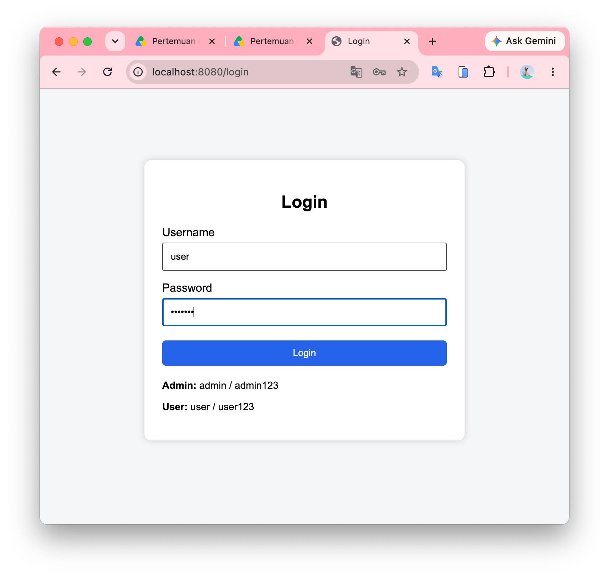
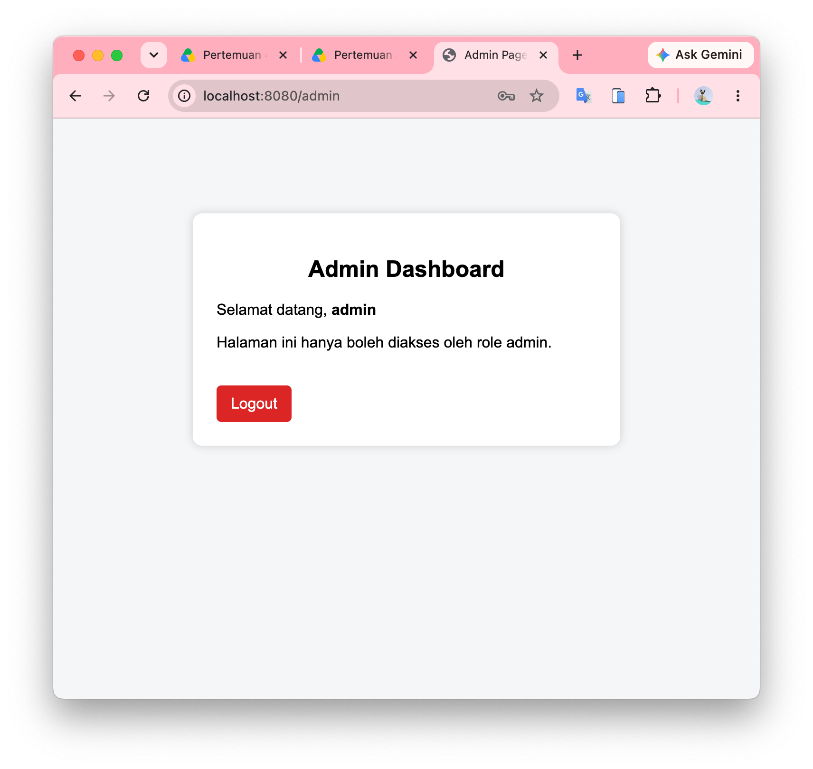
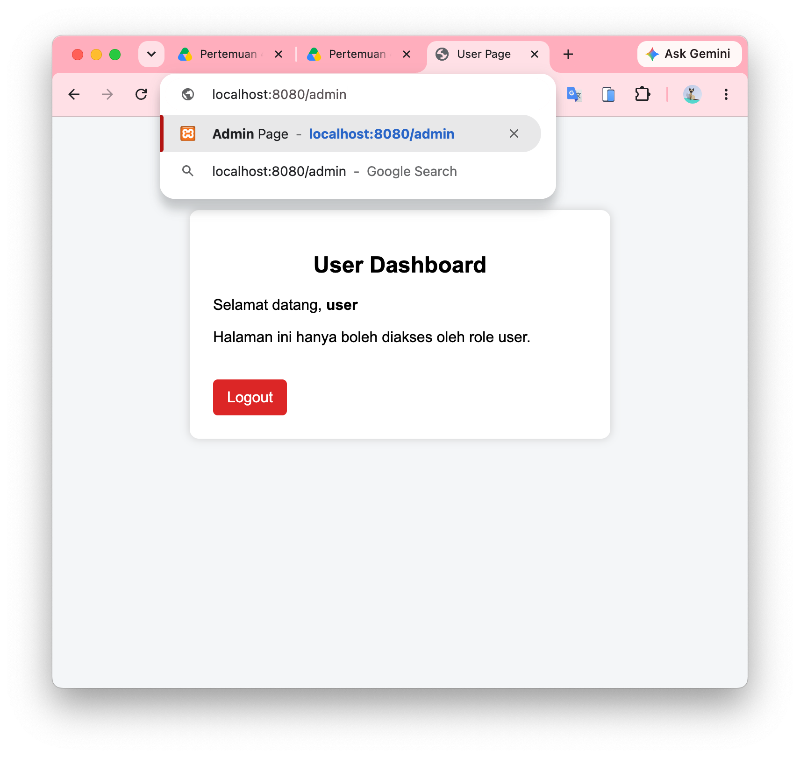
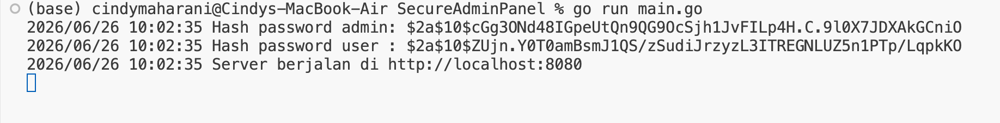

# Secure Admin Panel

Aplikasi web sederhana menggunakan **Go (Golang)** yang mengimplementasikan konsep **Authentication**, **Authorization (Role-Based Access Control)**, **Password Hashing**, **Session Management**, dan **Protected Endpoint**.

Project ini dibuat sebagai tugas mata kuliah **Authentication & Secure Web Application**.

---

## Features

* Login menggunakan username dan password
* Password disimpan dalam bentuk **bcrypt hash**
* Session management menggunakan **gorilla/sessions**
* Role-Based Access Control (RBAC)

  * Admin hanya dapat mengakses halaman **/admin**
  * User hanya dapat mengakses halaman **/user**
* Protected endpoint menggunakan middleware
* Logout

---

## Technologies

* Go 1.22+
* gorilla/sessions
* bcrypt (`golang.org/x/crypto/bcrypt`)
* HTML
* CSS

---

## Project Structure

```text
SecureAdminPanel
│
├── Backend
│   ├── Handlers
│   │   ├── auth.go
│   │   └── dashboard.go
│   │
│   ├── Middleware
│   │   └── auth.go
│   │
│   ├── config
│   │   └── db.go
│   │
│   └── models
│       └── user.go
│
├── Frontend
│   ├── static
│   │   └── style.css
│   │
│   └── template
│       ├── admin.html
│       ├── login.html
│       └── user.html
│
├── go.mod
├── go.sum
├── main.go
└── README.md
```

---

## Authentication Flow

1. User membuka halaman **/login**
2. User memasukkan username dan password
3. Server mengambil data user
4. Password diverifikasi menggunakan

```go
bcrypt.CompareHashAndPassword()
```

5. Jika berhasil:

* membuat session
* menyimpan:

  * username
  * role
  * authenticated

6. User diarahkan ke dashboard sesuai role.

---

## Session Data

Session menyimpan informasi berikut:

```text
authenticated = true
username
role
```

Session digunakan untuk:

* mengecek apakah user sudah login
* menentukan role user
* melindungi endpoint tertentu

---

## Role Access

| Role  | Endpoint |
| ----- | -------- |
| Admin | /admin   |
| User  | /user    |

Apabila role tidak sesuai, user akan diarahkan kembali ke halaman login.

---

## Default Account

### Admin

```text
Username : admin
Password : admin123
```

### User

```text
Username : user
Password : user123
```

Password yang tersimpan merupakan hasil hashing bcrypt dan **bukan plaintext**.

---

## How to Run

### 1. Clone repository

```bash
git clone https://github.com/username/SecureAdminPanel.git
```

Masuk ke folder project

```bash
cd SecureAdminPanel
```

### 2. Install dependency

```bash
go mod tidy
```

### 3. Jalankan aplikasi

```bash
go run main.go
```

Apabila berhasil akan muncul:

```text
Server berjalan di http://localhost:8080
```

Buka browser:

```
http://localhost:8080/login
```

---

## Password Hashing

Saat aplikasi dijalankan, terminal akan menampilkan hash password yang dihasilkan oleh bcrypt, misalnya:

```text
===== PASSWORD HASH =====

Plaintext : admin123

Hash :
$2a$10$.....................

Plaintext : user123

Hash :
$2a$10$.....................

=========================
```

---

## Security Features

* Password Hashing (bcrypt)
* Authentication
* Authorization
* Session Management
* Protected Endpoint
* Role-Based Access Control (RBAC)

---

## Learning Objectives

Project ini mengimplementasikan materi:

* Authentication
* Authorization
* Password Hashing
* Session Management
* Route Protection
* Middleware
* Role-Based Access Control (RBAC)

---
## Screenshots

### Login Page



### Admin Dashboard



### User Dashboard


### Unauthorized Access

User dengan role **user** mencoba mengakses endpoint **/admin** sehingga diarahkan kembali ke halaman login.



### Password Hashing

Contoh hasil hashing password menggunakan **bcrypt** yang ditampilkan pada terminal saat aplikasi dijalankan.



---
## Author

Nama : Cindy Maharani

Universitas Gunadarma
